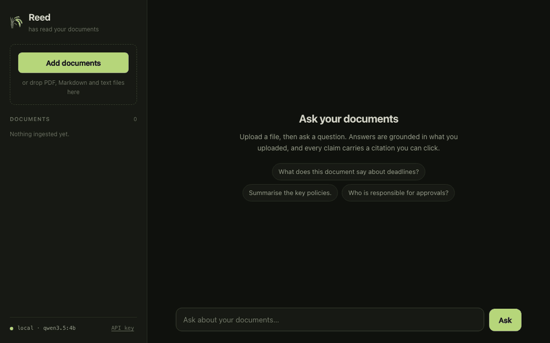
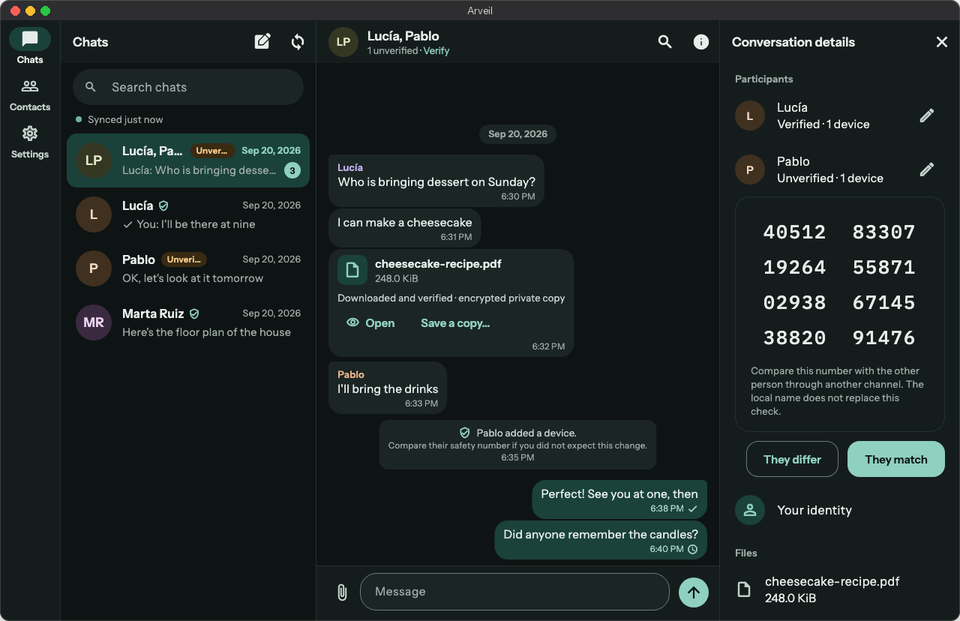
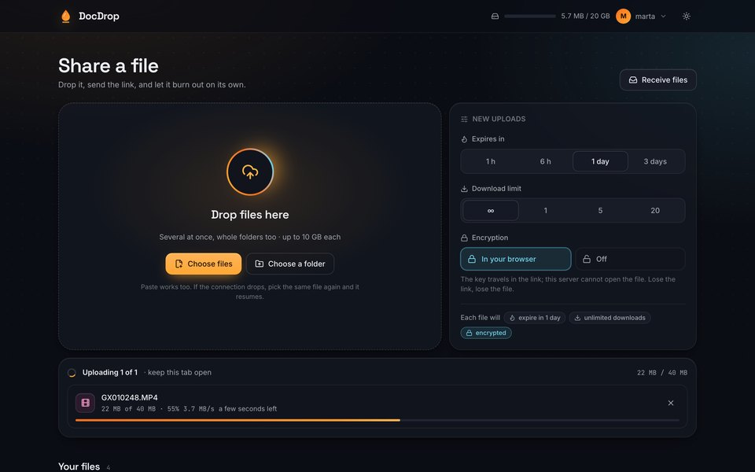
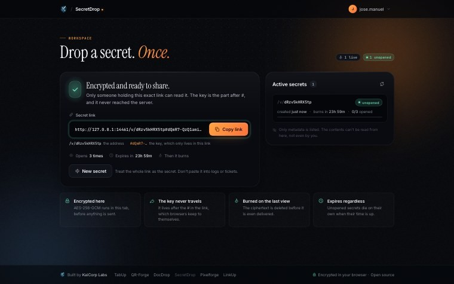

I build private AI and self-hosted software from Oviedo, Spain: tools that do useful work with your documents and files without sending them to someone else’s cloud.

I co-founded [Hesperia Labs](https://hesperialabs.com), where we deploy AI systems on our clients’ own infrastructure. I’m also a ServiceNow consultant at DXC Technology, currently for Grifols and Fluidra, and I teach AI and data science at Upgrade Hub in the evenings.

<table>
  <tr>
    <td width="50%" valign="top">
      
       <b><a href="https://github.com/Ulzuhan/reed">Reed</a></b> · answers from your documents, with sources
    </td>
    <td width="50%" valign="top">
      
       <b><a href="https://github.com/Ulzuhan/arveil">Arveil</a></b> · encrypted messenger for families
    </td>
  </tr>
  <tr>
    <td width="50%" valign="top">
      
       <b><a href="https://github.com/Ulzuhan/docdrop">DocDrop</a></b> · file transfer, encrypted in the browser
    </td>
    <td width="50%" valign="top">
      
       <b><a href="https://github.com/Ulzuhan/secretdrop">SecretDrop</a></b> · one-time secrets that burn after reading
    </td>
  </tr>
</table>

### Private AI

- **[reed](https://github.com/Ulzuhan/reed)** · Ask questions about your documents and get answers that cite their sources, or an honest “not enough evidence”.  
  Python, FastAPI, Qdrant, Ollama · hybrid dense + BM25 retrieval · 41-question golden set · 85% coverage gate
- **[reed-mcp](https://github.com/Ulzuhan/reed-mcp)** · Lets Claude and other MCP clients search your private documents, with citations.  
  Python · four read-only tools · about 160 ms per search
- **[private-ai-stack](https://github.com/Ulzuhan/private-ai-stack)** · A private ChatGPT plus document Q&A, behind one `docker compose up`.  
  Ollama, Qdrant, Open WebUI, Reed · installs fully offline · zero telemetry · tested backups

### Encryption and self-hosting

- **[arveil](https://github.com/Ulzuhan/arveil)** · An end-to-end encrypted messenger for families, on a small server you run at home.  
  Rust, Go, Flutter · MLS (RFC 9420) · threat model checked by about 620 tests · beta, not independently audited
- **[docdrop](https://github.com/Ulzuhan/docdrop)** · Send files up to 10 GB through links that expire, encrypted before they leave your browser.  
  Go, React · chunked AES-256-GCM · single binary on the Go standard library
- **[secretdrop](https://github.com/Ulzuhan/secretdrop)** · One-time links for passwords and keys that burn after the first view.  
  Go, React · the key never reaches the server · crash-safe burn
- **[signdrop](https://github.com/Ulzuhan/signdrop)** · Sign and verify PDFs in the browser, with signatures Acrobat accepts.  
  TypeScript · PAdES with RFC 3161 timestamps · verified against 29 EU trusted lists
- Also: [tabup](https://github.com/Ulzuhan/tabup) (shared expenses) · [qr-forge](https://github.com/Ulzuhan/qr-forge) (editable QR codes) · [linkup](https://github.com/Ulzuhan/linkup) (URL shortener without tracking) · [pixelforge](https://github.com/Ulzuhan/pixelforge) (local background removal) · [kaicorp-account](https://github.com/Ulzuhan/kaicorp-account) (one sign-in for all of them)

All of these run on hardware I own, at [kaicorplabs.com](https://kaicorplabs.com).

### Apps

- **[macthermal](https://github.com/guillerDev/macthermal)** · Your Mac’s temperatures and fan speeds straight from the SMC, as a CLI and a menu-bar app, with a plain-English verdict. Co-developed with [@guillerDev](https://github.com/guillerDev).  
  Swift 6 · IOKit, no dependencies, no sudo · Apple Silicon and Intel · <code>brew install guillerDev/tap/macthermal</code>
- **[Stoa](https://ulzuhan.github.io/stoa/)** and **[Faro de Fe](https://ulzuhan.github.io/beacon-of-faith/)** · Flutter apps on Google Play. No accounts, no analytics, everything stays on the phone.

### Latest releases

<!-- releases:start -->
- **[linkup](https://github.com/Ulzuhan/linkup)** [v0.8.2](https://github.com/Ulzuhan/linkup/releases/tag/v0.8.2) · Oct 6, 2026
- **[qr-forge](https://github.com/Ulzuhan/qr-forge)** [v0.7.1](https://github.com/Ulzuhan/qr-forge/releases/tag/v0.7.1) · Oct 5, 2026
- **[secretdrop](https://github.com/Ulzuhan/secretdrop)** [v0.9.2](https://github.com/Ulzuhan/secretdrop/releases/tag/v0.9.2) · Oct 4, 2026
- **[docdrop](https://github.com/Ulzuhan/docdrop)** [v3.1.2](https://github.com/Ulzuhan/docdrop/releases/tag/v3.1.2) · Oct 4, 2026
- **[arveil](https://github.com/Ulzuhan/arveil)** [v0.2.0](https://github.com/Ulzuhan/arveil/releases/tag/v0.2.0) · Oct 1, 2026
- **[pixelforge](https://github.com/Ulzuhan/pixelforge)** [v0.8.0](https://github.com/Ulzuhan/pixelforge/releases/tag/v0.8.0) · Sep 14, 2026
<!-- releases:end -->

Updated every six hours by [a workflow](.github/workflows/releases.yml).

### Teaching

- **[Masterclass-YOLO](https://github.com/Ulzuhan/Masterclass-YOLO)** · From CNNs to YOLO: the computer vision material I use with my bootcamp students.

 

[ulzuhan.github.io](https://ulzuhan.github.io) · [LinkedIn](https://www.linkedin.com/in/manulinares6) · [manuel@hesperialabs.com](mailto:manuel@hesperialabs.com)
